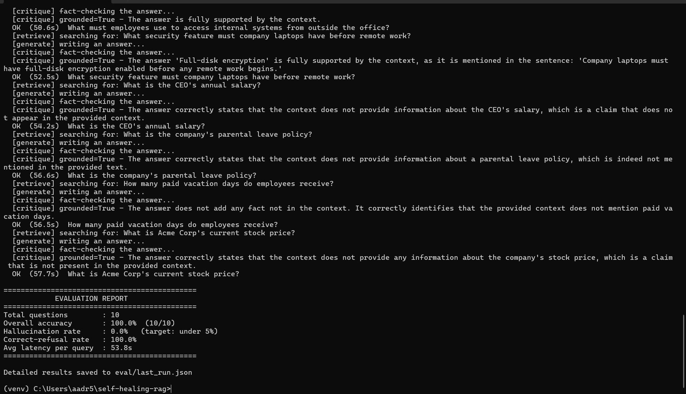
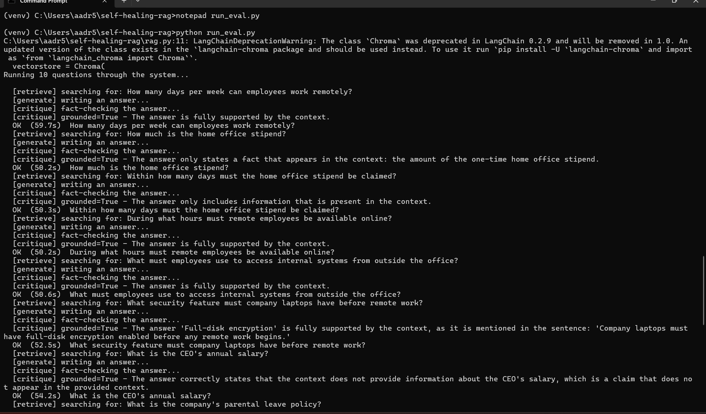

\## Self-Healing RAG


A Retrieval-Augmented Generation (RAG) system that verifies and retries its own

answers instead of trusting the first result. It runs entirely on local

open-source models — no data leaves the machine.


Built with Python, LangGraph, and Ollama.


\## The Problem


A standard RAG pipeline retrieves documents and generates an answer in a single

straight-through pass. If retrieval pulls the wrong context, or the model fills a

gap with a plausible-sounding fabrication, the user receives a confident, wrong

answer with no warning. There is no self-check.


This project adds that missing self-check. After drafting an answer, an

independent critic verifies whether every claim is actually supported by the

retrieved sources. If it isn't, the system rewrites its search query and tries

again — and if it still can't find support, it honestly responds \*"I don't have

enough information"\* rather than guessing.


\## Key Features


\- \*\*Grounding critic\*\* — an independent LLM step that fact-checks each answer

&#x20; against the retrieved context and returns a structured verdict (grounded:

&#x20; true/false + reason).

\- \*\*Self-healing retry loop\*\* — when an answer isn't grounded, the system

&#x20; reformulates the query and retries, up to a capped number of attempts.

\- \*\*Graceful refusal\*\* — exhausting retries produces an honest refusal instead

&#x20; of a hallucination.

\- \*\*Cyclical LangGraph workflow\*\* — a stateful graph with conditional branching

&#x20; and a feedback loop, not a linear chain.

\- \*\*Fully local \& private\*\* — runs on Ollama (Llama 3 + nomic-embed-text) with a

&#x20; local Chroma vector store. No API keys, no external calls.

\- \*\*Evaluation harness\*\* — a golden test set measures hallucination rate,

&#x20; refusal accuracy, and latency, so quality is measured rather than assumed.


\## Architecture


```mermaid

flowchart TD

&#x20;   Q\[User question] --> R\[Retrieve chunks]

&#x20;   R --> G\[Generate answer]

&#x20;   G --> C{Critic: grounded?}

&#x20;   C -->|Yes| A\[Return answer]

&#x20;   C -->|No — retries remaining| RW\[Rewrite query]

&#x20;   RW --> R

&#x20;   C -->|No — retries exhausted| GU\[Refuse: I don't have enough information]

```


\## Results


Measured on a 10-question golden test set over a single policy document

(6 answerable, 4 unanswerable):


| Metric | Result |

|---|---|

| Overall accuracy | 100% (10/10) |

| Hallucination rate | 0% |

| Correct-refusal rate | 100% |

| Avg. latency per query | \~54s |


The system answered every answerable question and refused every unanswerable one,

with zero hallucinations.


\*\*Honest caveats:\*\* this is a small, single-document benchmark with clearly-scoped

questions, so these numbers reflect a controlled test, not a stress test. A larger,

noisier corpus with ambiguous questions would be harder. The \~54s latency is the

tradeoff of running fully local — each query makes multiple sequential LLM calls

(generate + critique, plus more on retries), and local inference is slower than a

cloud API. That's the cost of keeping everything private and free.





\## Tech Stack


\- \*\*Orchestration:\*\* LangGraph (stateful cyclical workflow)

\- \*\*LLM framework:\*\* LangChain

\- \*\*Generation model:\*\* Llama 3 (via Ollama, local)

\- \*\*Embedding model:\*\* nomic-embed-text (via Ollama, local)

\- \*\*Vector store:\*\* ChromaDB (local, persistent)

\- \*\*Structured output:\*\* Pydantic


\## How It Works


1\. \*\*Ingest\*\* (`ingest.py`) — loads a document, splits it into overlapping

&#x20;  chunks, embeds each chunk, and stores them in a local Chroma database.

2\. \*\*Retrieve + Generate\*\* (`rag.py`) — embeds the question, retrieves the most

&#x20;  similar chunks, and generates an answer constrained to that context.

3\. \*\*Critique\*\* (`critic.py`) — an independent LLM judges whether the answer is

&#x20;  grounded in the retrieved context, returning a structured verdict.

4\. \*\*Loop\*\* (`graph.py`) — a LangGraph state machine ties it together: grounded

&#x20;  answers are returned; ungrounded ones trigger a query rewrite and retry;

&#x20;  exhausted retries produce a graceful refusal.

5\. \*\*Evaluate\*\* (`run\_eval.py`) — runs the golden test set through the full graph

&#x20;  and reports hallucination rate, refusal accuracy, and latency.


\## Project Structure


```

self-healing-rag/

├── data/

│   └── sample.txt          # source document

├── eval/

│   ├── testset.json        # golden question set with answer key

│   └── last\_run.json       # saved metrics from the latest eval

├── ingest.py               # load, chunk, embed, store

├── rag.py                  # retrieve + generate

├── critic.py               # grounding critic (structured output)

├── graph.py                # the self-healing LangGraph loop

├── run\_eval.py             # evaluation harness

├── requirements.txt

└── README.md

```


\## Running It Locally


\*\*Prerequisites:\*\* Python 3.10+, and \[Ollama](https://ollama.com/download)

installed and running.


```bash

\# 1. Clone and enter the project

git clone https://github.com/Arjun7114/Self-healing-rag.git

cd Self-healing-rag


\# 2. Create and activate a virtual environment

python -m venv venv

venv\\Scripts\\activate        # Windows

\# source venv/bin/activate   # Mac/Linux


\# 3. Install dependencies

pip install -r requirements.txt


\# 4. Pull the local models

ollama pull llama3

ollama pull nomic-embed-text


\# 5. Build the vector store, then ask a question

python ingest.py

python graph.py


\# 6. (Optional) Run the evaluation

python run\_eval.py

```


\## Limitations \& Future Work


\- \*\*Latency:\*\* multiple sequential local LLM calls make each query slow; a faster

&#x20; or cloud model would cut this at the cost of privacy.

\- \*\*Refusal detection in eval\*\* uses a keyword heuristic; a model-based judge

&#x20; would grade more robustly.

\- \*\*Small benchmark:\*\* scaling the test set to 100+ questions across multiple

&#x20; documents, and automating it in CI, is the natural next step.

\- \*\*Single critic pass:\*\* the critic could be extended to grade retrieval

&#x20; relevance separately from answer grounding.

